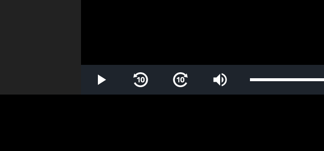

# streaming-plus-sequencer

This is a browser extension that adds "Skip 10 seconds" and "Back 10 seconds" buttons to the viewing screen of archived videos on Streaming+ (live.eplus.jp), eplus's video streaming service.

eplus の動画配信サービス Streaming+ (live.eplus.jp) で、アーカイブ動画の視聴画面に「10秒スキップ」「10秒バック」などの操作を行う機能を追加するブラウザ拡張機能です。

## Feature

この拡張機能をインストールすることによって、 Streaming+ のアーカイブ視聴画面に以下の機能が追加されます。

* コントロールバーに動画を10秒スキップ・バックの操作を行うボタンの追加
* 左右矢印キーによって動画を10秒スキップ・バックの操作を行う機能の追加
* スペースキーによって動画の再生を一時停止・再開する操作の追加

## Available on

 

## License

[Mozilla Public License Version 2.0](LICENSE)

## Copyright

&copy; 2023 windyakin

## Author

* windyakin
